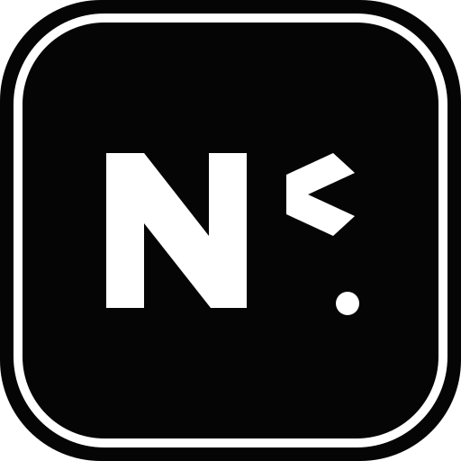

<div align="center">

<a href="https://github.com/NestorCobos">
  
</a>

# NESTOR SANTIAGO COBOS MANRIQUE

### `Software Developer in Training` · `Web` · `Backend` · `Frontend` · `AI`


<br>

[](https://github.com/NestorCobos)
[](https://www.instagram.com/coboxns_16/)
[](https://www.linkedin.com/in/nestor-santiago-cobos-cobos-abb80240a/)
[](https://portafolio-nestor-cobos.vercel.app/)

<br>


</div>

---

## 🧑‍💻 SOBRE MÍ

<table>
<tr>
<td width="58%">

Soy **Nestor Santiago Cobos Manrique**, estudiante de **Desarrollo de Software en Campuslands** y desarrollador en formación con nivel intermedio.

Me interesa entender cómo funciona la tecnología de extremo a extremo: desde una interfaz que una persona disfruta usar, hasta la lógica del backend que hace que todo ocurra detrás de escena.

Actualmente estoy enfocado en:

- 🌐 Desarrollo web
- 🎨 Frontend
- ⚙️ Backend
- 🤖 Inteligencia Artificial
- 🧠 Lógica y resolución de problemas
- 🚀 Construcción de proyectos reales

Mi siguiente gran reto es **dominar JavaScript** y profundizar cada vez más en desarrollo web e Inteligencia Artificial.

</td>
<td width="42%" align="center">


<br><br>

**17 años**  
📍 Bucaramanga, Santander, Colombia  
🎓 Campuslands  
💻 Desarrollo de Software  
📈 Nivel: Intermedio

</td>
</tr>
</table>

> ### ⚡ Mi mentalidad
> **No quiero aprender programación solamente para escribir código. Quiero aprenderla para construir cosas que hablen por mí, resolver problemas reales y convertir mi conocimiento en oportunidades.**

---

## 🧠 LO QUE ESTOY CONSTRUYENDO

```text
                    ┌──────────────────────────┐
                    │       NESTOR COBOS       │
                    │   SOFTWARE DEVELOPER     │
                    └────────────┬─────────────┘
                                 │
              ┌──────────────────┼──────────────────┐
              ▼                  ▼                  ▼
         🌐 WEB              ⚙️ BACKEND          🤖 AI
              │                  │                  │
              └──────────────────┼──────────────────┘
                                 ▼
                       🚀 PRODUCTOS REALES
                                 │
                                 ▼
                    💼 SERVICIOS AUTÓNOMOS
                                 │
                                 ▼
                         🏢 MI PROPIA EMPRESA
```

---

## 🛠️ TECH STACK

<div align="center">

### Lenguajes


### Web & Backend


### Herramientas


</div>

### 📌 Nivel actual

| Área | Estado | Enfoque |
|---|:---:|---|
| HTML5 | 🟢 | Desarrollo web |
| CSS3 | 🟢 | Interfaces responsive |
| JavaScript | 🟡 | **Tecnología que quiero dominar** |
| Python | 🟡 | Lógica, algoritmos y proyectos |
| Java | 🟡 | Programación orientada a objetos |
| Backend | 🟡 | Arquitectura y servicios |
| Bases de datos | 🟡 | Fundamentos y práctica |
| Inteligencia Artificial | 🔵 | Área de crecimiento |
| Git & GitHub | 🟡 | Control de versiones |
| Docker | 🔵 | Aprendizaje / exploración |

> 🟢 Base sólida · 🟡 En desarrollo · 🔵 Explorando

---

## 📊 LANGUAGE STACK

<div align="center">


</div>

---

## 🔥 ACTIVIDAD DE GITHUB

<div align="center">


<br><br>


</div>

---

## 📈 ESTADÍSTICAS

<div align="center">

<table>
<tr>
<td>

</td>
<td>

</td>
</tr>
</table>

</div>

---

## 🏆 TROFEOS

<div align="center">


</div>

---

## 🐍 CONTRIBUTION SNAKE

<div align="center">


</div>

> Si la animación todavía no aparece, activa el workflow de Snake incluido en la sección de instalación de este paquete.

---

## 🎯 OBJETIVOS

### 🚀 Próximos 6 meses

- [x] Construir bases sólidas en desarrollo de software.
- [x] Comenzar a trabajar con proyectos reales.
- [ ] Dominar JavaScript.
- [ ] Mejorar significativamente mis habilidades de desarrollo web.
- [ ] Profundizar en backend y bases de datos.
- [ ] Comenzar a integrar Inteligencia Artificial en proyectos.
- [ ] Construir una oferta de servicios como desarrollador independiente.
- [ ] Conseguir mis primeros clientes de manera autónoma.

### 📈 Próximo año

- [ ] Consolidarme como desarrollador Full Stack en formación.
- [ ] Crear soluciones web completas para clientes.
- [ ] Fortalecer mi perfil en Inteligencia Artificial.
- [ ] Tener un portafolio con proyectos profesionales.
- [ ] Convertir mis habilidades técnicas en una fuente de ingresos autónoma.

### 🏢 Largo plazo

> **Crear mi propia empresa tecnológica y construir un espacio de capacitación y formación para nuevos programadores.**

---

## 📚 FORMACIÓN

| Formación | Estado |
|---|---|
| 🎓 Desarrollo de Software — Campuslands | 🔄 En curso |
| 💻 Curso de programación básica — Platzi | ✅ 2021 |
| 🌎 Inglés | 📚 A3 |
| 🧠 Formación autodidacta en tecnologías web e IA | 🔄 Continua |

---

## 🧪 LO QUE ESTOY APRENDIENDO

```text
JavaScript             █████████████████░░░  Enfoque principal
Desarrollo Web         ████████████████░░░░  En crecimiento
Backend                ██████████████░░░░░░  En crecimiento
Bases de Datos         ████████████░░░░░░░░  En práctica
Inteligencia Artificial██████████░░░░░░░░░░  Explorando
```

Mi objetivo no es acumular tecnologías en una lista.

**Quiero entenderlas, conectarlas y convertirlas en soluciones.**

---

## 💼 DISPONIBLE PARA OPORTUNIDADES

Estoy construyendo mi perfil para poder ofrecer servicios de desarrollo de manera independiente.

### Puedo aportar en:

- 🌐 Desarrollo y maquetación web
- 🎨 Interfaces frontend
- ⚙️ Lógica backend
- 🗄️ Soluciones con bases de datos
- 🔧 Mantenimiento y mejoras de sitios web
- 🤖 Exploración e integración de IA
- 📱 Diseño responsive
- 🚀 Prototipos y MVPs

> **Si tienes una idea, un problema o un proyecto que necesite código, hablemos.**

---

## 📫 CONTACTO

<div align="center">

| Canal | Enlace |
|---|---|
| 📧 Email | [54790346688nestor@gmail.com](mailto:54790346688nestor@gmail.com) |
| 📱 WhatsApp | [32909954324](https://wa.me/5732909954324) |
| 📸 Instagram | [@coboxns_16](https://www.instagram.com/coboxns_16/) |
| 💼 LinkedIn | [Nestor Santiago Cobos](https://www.linkedin.com/in/nestor-santiago-cobos-cobos-abb80240a/) |
| 🌐 Portafolio | [portafolio-nestor-cobos.vercel.app](https://portafolio-nestor-cobos.vercel.app/) |
| 💻 GitHub | [@NestorCobos](https://github.com/NestorCobos) |

</div>

---

## 🧩 PROYECTOS

Actualmente **no estoy mostrando proyectos individuales en esta sección de mi perfil**. Estoy priorizando la construcción de habilidades y un portafolio profesional que represente mejor mi evolución.

Puedes consultar mi actividad directamente en:

**[→ Ver mi GitHub](https://github.com/NestorCobos)**

---

## ⚡ MI FRASE

<div align="center">

### **"No vine a aprender a programar para buscar un lugar. Vine a programar para construir el mío."**

`NESTOR COBOS // BUILDING THE NEXT VERSION`

</div>

---

<div align="center">

### 🖤 WHITE MIND. BLACK CODE. BIG IDEAS.


<br><br>

**Gracias por visitar mi perfil.**

</div>
